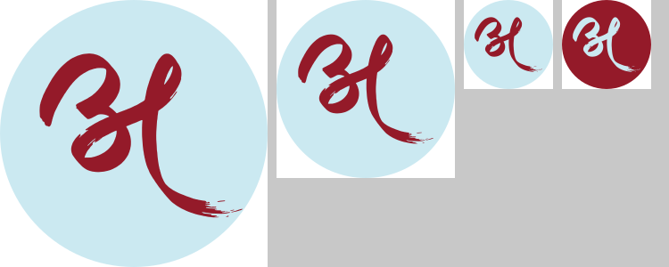

# TOP label logo: CorelDRAW files

Three separate files, one per size, converted from `TOP_lable_logo_top.ai`. All artwork is vector and keeps the original CMYK colours.

| File | Circle size (measured in the file) |
|---|---|
| `TOP_label_logo_Large_3in.cmx` | 3.000 × 3.000 in (76.2 mm) |
| `TOP_label_logo_Medium_2in.cmx` | 2.000 × 2.000 in (50.8 mm) |
| `TOP_label_logo_Small_1in.cmx` | 1.000 × 1.000 in (25.4 mm) |

Each file holds a maroon mark on a light-blue circle. Sizes were checked by reading the saved file back. The largest deviation is 0.003 pt (0.001 mm).

**Colours (CMYK)**
- TOP Light Blue: C19 M0 Y4 K0
- TOP Maroon: C27 M100 Y86 K26

## Getting a .cdr
CMX (Corel Presentation Exchange) is Corel's own vector format, and CorelDRAW opens it natively.

1. CorelDRAW → **File → Open** → one of the `.cmx` files.
2. **File → Save As** → *CDR - CorelDRAW*. Repeat for each file.

The layer in each file is named Large 3in / Medium 2in / Small 1in. If you want the page itself to match the logo, set its size in Layout → Page Size. The logo is centred on the page.
