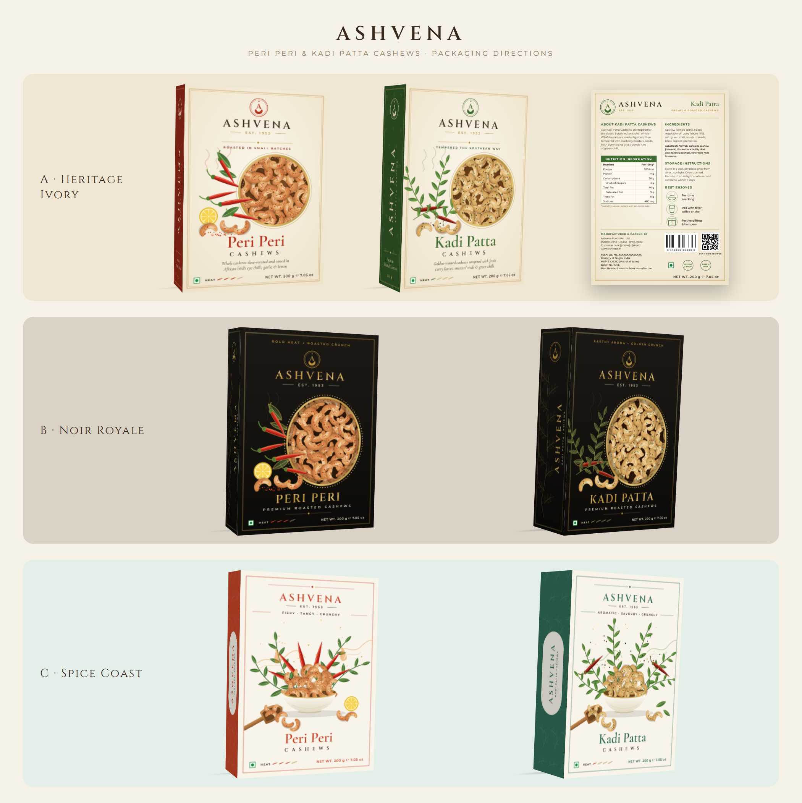

# Ashvena: Cashew Packaging Designs

Three carton design directions for **Peri Peri Cashews** and **Kadi Patta Cashews**, based on the Spice Royale / botanical spice-box references.



| Direction | Look |
|---|---|
| **A · Heritage Ivory** | Cream carton, botanical illustration, gold-ringed round window showing seasoned cashews, coloured side panel. Includes full **back panels** (about, ingredients, nutrition, storage, serving ideas, barcode/QR, FSSAI). |
| **B · Noir Royale** | Black and gold premium carton, oval beaded gold frame, gold-outlined botanicals, engraved vine on the side. |
| **D · Peacock Flash** | Wrap-around jar/tin label (220 × 180 mm: 155 mm front + 65 mm info panel), modelled on the striped "tattoo mascot" label reference. Tattoo-style peacock perched on a chilli / curry-leaf branch, vertical ASHVENA on both sides, stripe bands, and a rotated info panel (about, ingredients, allergens, storage, manufacturer, barcode). Fonts: DM Serif Display + Inter. |
| **E · Royal Collection** | Festive gift-box lid (250 × 250 mm) in *Midnight* and *Ivory* colourways. Ornamental vector elements (jaali lattice, lotus-petal border, mandala corner rosettes, a cusped Mughal jharokha arch with pillars and bead garland) around twin peacocks (Peri Peri chilli branch, Kadi Patta curry-leaf branch) and a brass urn of cashews. |
| **F · Palace Garden** | Box belts / sleeve bands (297.04 × 74.8 mm) for **Aam Papad** and **Fruit Cocktail**, a bright version of the pastel Rajasthani palace-garden references. Six bays in festive colours (palm and potted fruit tree, a cusped arched niche with a banana tree and jaali parapet, twin palms, banana leaves, a jharokha window with jaali, an arched niche with a fruit tree) flank a central cusped-arch cartouche. That cartouche holds the brand, the product name, a veg mark and the net weight, with mangoes and aam papad slabs (or mixed fruit) on either side. Two colourways: **v1** (`*_belt.*`) in bright festive colours, and **v2** (`*-v2_belt.*`) in the client palettes. The v2 Aam Papad belt uses coral, mango gold, light yellow and mango, with deep maroon for type. The v2 Fruit Cocktail belt uses raspberry, pink grapefruit, lemon, lime and vanilla. Both v2 belts use softer sage foliage. **v3** (`*-v3_belt.*`, `scripts/generate_belts_heritage.py`) is rebuilt to the Diwali 2026 style guide: gold-ink line work over watercolour washes, a brass-bowl hero (aam papad, or fruit chews with raspberry, lime, lemon and pink grapefruit) under a faint arch and palms, Fraunces / Bricolage Grotesque / Lobster type, the candy strip "MADE WITH REAL FRUIT · 73-YEAR-OLD RECIPE · NO ADDED COLOUR" on the bottom band and the sign-off "Heirloom, remixed. · Since 1953". The logo group `Logo_PLACEHOLDER…` is a typeset stand-in in the original colours: replace it with `Ashvena logo final.pdf`. The group `Texture_Overlay` (paper grain and watercolour mottling) can be deleted for flat colour. **v4** (`*-v4_belt.*`, `scripts/generate_belts_watercolour.py`) uses the house watercolour look: a painted Magnific panorama (Nano Banana Pro, styled on the existing Ashvena band art) sits full-bleed under a live vector layer with the logo, product name, sign-off, candy strip, bands, veg mark and net weight. Put the art at `F-palace-garden/art/ashvena-<flavour>-watercolour.png` (4096 × 1032 px) and rerun the script; until then the art layer is a labelled placeholder. Illustrator files: `F-palace-garden/ai/Ashvena-Belt-297x74.8-<Flavour>.ai` (PDF-compatible .ai, live type, painting embedded). Fonts: Cinzel, DM Serif Display, Cormorant Garamond, Montserrat. |
| **C · Spice Coast** | Bright illustrated scene: a bowl heaped with cashews, flowing botanicals, a wooden scoop, and a colour-block side panel. |

## G · Thank-you cards (stall)
A6 cards (105 × 148 mm, artboards include 3 mm bleed) for every stall purchase.
- **Fronts:** four "Heirloom, remixed" Gen Z lines: *Old school recipe. New school cravings.* · *We've been viral since 1953. The internet just found out.* · *Tradition? Check. Vibes? Double check.* · *Our elders made it. You made it trendy.* Each has three colour options (`options/`, board: `options/ashvena-thankyou-options-board.png`) in the brand brick red `#941528` and dispensary blue `#cbe9f1`, plus darker and lighter tones (deep red `#5e0b19`, rose `#d0566a`, blush `#f6d3d8`, deep blue `#2b6a7c`, mid blue `#8fc6d6`, ice `#eef8fb`). Set the chosen option per message in `FRONTS` in `scripts/generate_thankyou_cards.py`; the print set is currently 1A, 2A, 3A, 4A.
- **Back (shared):** khadi cream, the stacked logo, "Thank you for bringing us home.", a short note from the 1947 / 1953 family story, and a QR code to `https://wa.me/917988626068` (customer care on WhatsApp).
- **Files:** `ashvena-thankyou-front-NN` and `-back` as SVG / PDF / PNG; `Ashvena-ThankYou-Cards-A6-duplex-print.pdf` (front, back, front, back … with TrimBox at 105 × 148 mm); `ai/` has one Illustrator file per card.
- **Brand assets:** `brand/Ashvena logo final.pdf` (source), `brand/ashvena-logo-stacked.svg` and `-horizontal.svg` (vector, original colours), `brand/fonts/BricolageGrotesque-CondensedExtraBold.ttf` (OFL; install it to edit the fronts).

## Files (per direction folder)
- `*_front-side.svg` is the **editable master for Adobe Illustrator** (File → Open). The artboard is 165 × 170 mm: a 45 mm side panel plus a 120 mm front panel. Named groups (`Front_Panel`, `Illustration`, `Product_Name`, `Footer`, `Side_Panel`, …) appear as layers. Text is live.
- `*_back.svg` (Direction A only) is the back panel, 120 × 170 mm.
- `*.pdf` is a vector PDF at the same size, and `*.png` is a preview.

**Fonts** (free, Google Fonts): Cinzel, Cormorant Garamond, Montserrat, plus DM Serif Display and Inter for D. Install them before opening in Illustrator.

## Before print, replace these placeholders
- Nutrition values (indicative only), ingredient percentages, and claims ("Made in India"). Get them from your lab report and your recipe.
- FSSAI licence no., address, MRP, barcode (EAN), QR code, batch and dates.
- Add bleed (3 mm), glue flap, top and bottom tuck flaps for your printer's actual dieline.
- Belts (F): the artboard is the exact 297.04 × 74.8 mm trim, with no bleed or overlap/glue tab. Set the product descriptor and net weight, and check where the box edges fall so the centre cartouche lands on the front face.

## Regenerate
```
pip install playwright
python3 scripts/generate_packaging.py   # SVGs (A-C)
python3 scripts/generate_wrap_labels.py # SVGs (D)
python3 scripts/generate_gift_box.py    # SVGs (E)
python3 scripts/generate_belts.py       # SVGs (F v1, v2)
python3 scripts/generate_belts_heritage.py  # SVGs (F v3)
python3 scripts/generate_belts_watercolour.py  # SVGs (F v4, needs art/*.png)
python3 scripts/render_previews.py      # PNG + PDF (optionally: a folder name, e.g. F-palace-garden)
python3 scripts/render_mockups.py       # 3D board
python3 scripts/export_ai.py            # F v4 belts as Illustrator .ai (after render_previews)
python3 scripts/generate_thankyou_cards.py && python3 scripts/render_previews.py G-thank-you-cards && python3 scripts/generate_thankyou_cards.py --export   # G
```
