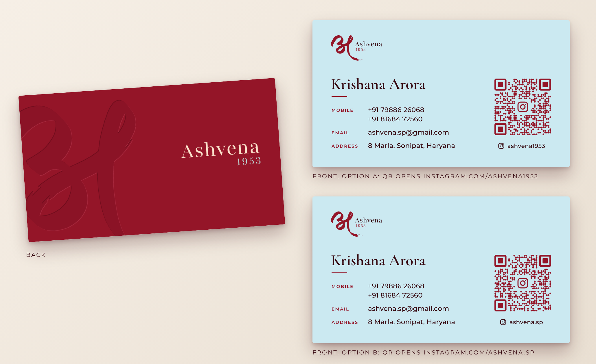

# Ashvena 1953: Visiting Card



A simple, premium two-colour card: plain colour, the logo and type, with no illustration.

| Side | Look |
|---|---|
| **Front: Dispensary blue** (`#CBE9F1`) | Horizontal logo lockup, **Krishana Arora** in Cormorant Garamond, a short Brick rule, then labelled rows: two mobile numbers, email and address. On the right is a dotted Instagram QR code in Brick with the Instagram glyph in the centre. Its caption sits on the same line as the address. |
| **Back: Brick red** (`#941528`) | An oversized logo mark, tone on tone with a soft debossed edge, bleeds off the left and bottom. The wordmark is in Khadi Cream with the year in sage, on the right. |

**Premium finish (optional):** the back's `Emboss_Mark` layer can go to the printer as a **blind-deboss** or **spot-UV** plate. Then the mark is felt rather than printed, as on the Shifo reference. Use a heavy uncoated or cotton stock (350 gsm or more).

## Choose the Instagram QR
There are two fronts. They are identical except for the QR code:

| Option | QR opens | Files |
|---|---|---|
| A | instagram.com/ashvena1953 | `*_front_ashvena1953.*`, `*_print_ashvena1953.pdf` |
| B | instagram.com/ashvena.sp | `*_front_ashvena.sp.*`, `*_print_ashvena.sp.pdf` |

Scan each code with a phone and keep the option that opens the right profile. Both codes were checked with the ZXing and OpenCV decoders. They use error correction level H, so the centre glyph does not affect scanning. The printed code is 19.6 mm wide.

## Size
3.5 × 2 in (88.9 × 50.8 mm) trim, plus 3 mm bleed on every side, so the artboard is 94.9 × 56.8 mm. The `.ai` and PDF files have their TrimBox and BleedBox set.

## Files
- `*.ai` are PDF-compatible Illustrator files, one artboard each, with bleed. Everything stays vector and the fonts are embedded.
- `ashvena-visiting-card_print_<handle>.pdf` is a 2-page print file (page 1 front, page 2 back).
- `*.svg` are the editable masters. They have named layers (`Logo`, `Name_Block`, `Contact_Details`, `QR_Instagram`, `QR_Caption`, `Emboss_Mark`, `Wordmark`, and a hidden `Trim_Guide`) and live text.
- `*.png` are previews cropped to the trim. `ashvena-visiting-card-board.png` shows all three.

**Fonts** (free, Google Fonts): Cormorant Garamond and Montserrat.

## Regenerate
Edit `CARD` or `HANDLES` in `scripts/generate_visiting_card.py`, then run:
```
pip install playwright pypdf segno
python3 scripts/generate_visiting_card.py
```
